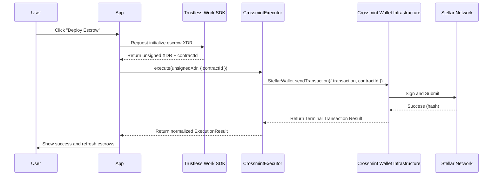

# Transaction Flow: Trustless Work × Crossmint

## Sequence Diagram

## Step-by-Step Flow

### 1. Request XDR
When a user initiates an escrow action (Deploy, Fund, Approve, etc.), the app calls the corresponding method in the Trustless Work SDK.

### 2. Receive Unsigned Transaction
The Trustless Work SDK returns an unsigned XDR envelope and the `contractId` of the target smart contract.

### 3. Delegate to Crossmint
The app passes the XDR and `contractId` to the `useCrossmintExecutor`. This executor is specifically designed to bridge Trustless Work XDRs with the Crossmint Stellar Wallet API.

### 4. Crossmint Execution
The executor converts the generic Crossmint wallet to a `StellarWallet` and calls `sendTransaction`. Crossmint handles:
- Securely signing the transaction with the user's embedded wallet.
- Submitting the signed transaction to the Stellar Testnet.
- Managing fees and sequence numbers.

### 5. Confirm and Sync
Once the transaction is confirmed on-chain, Crossmint returns the transaction hash. The app then:
- Displays a success message to the user.
- Triggers the Trustless Work indexer to sync the new state using the hash.
- Refreshes the local UI to reflect the updated escrow status.

## Current Status of Transaction Flow
The Crossmint execution flow is planned and supported by implementation for the following actions, though terminal success is currently blocked by the "C vs G" address mismatch on the Trustless Work API:

- **Deploy Escrow**: Tested (failing with `invalid version byte`).
- **Milestone Updates**: Untested (blocked by deployment).
- **Approvals**: Untested (blocked by deployment).
- **Fund Releases**: Untested (blocked by deployment).
